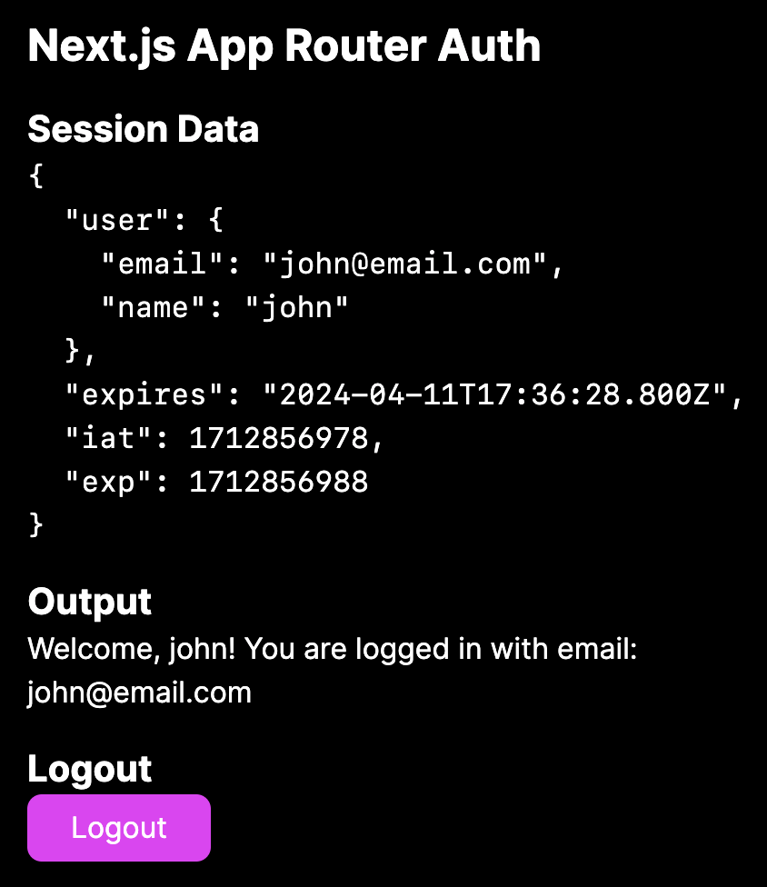

# Next.js App Router Authentication

This is a simple example of how to implement a simple authentication with no libraries in Next.js App Router

> Note: This example does not use a database to store user credentials, in a real application you should use a database and modify the expiration time in `lib.ts` (see comment)

#### Screenshot



## Getting Started

Clone the repository, then:

```bash
npm i
npm run dev
```

Open [http://localhost:3000](http://localhost:3000) with your browser to see the result

## Resources

- [Next.js Authentication](https://nextjs.org/docs/app/building-your-application/authentication)
- [Lucia Auth](https://lucia-auth.com/)
- [NextAuth](https://next-auth.js.org/)
